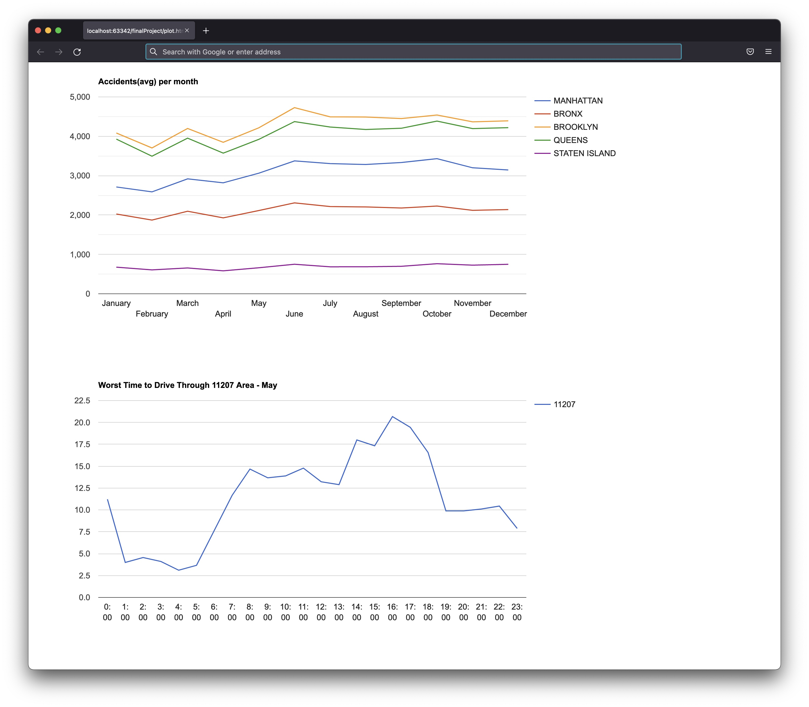

# NYC Collisions

We will use NYC OpenData API to collect data about collisions in New York City for the last 12 years.
The program will start asking for a number of collisions, then it will call the API to get that number of collisions and store the raw data into a local database. It is a restartable process, so you can start it back up and run it repeatedly until the database is up-to-date. We will also collect information about boroughs and zipcode areas from NYC using the same API. We will clean and normalize the data to insert it into a new collisions table. Having this clean version of the data, we will write two queries. The first query will retrieve the number of collisions per month, on average, in each borough. The second query will retrieve the number of accidents per hour, on average, in one day period in a specific month and zip code area. The data obtained from both queries will produce a couple of .js files, which, combined with a .html file, will help us plot the data. 
The entire program was built using Python and Postgresql 
